# APLICACION NUTRICIONAL 
#### REGIS REYES JAZMIN ARLETH, ZEFERINO LEONARDO ANETTE MICHEL.
### Objetivos de la investigación 
Nuestro objetivo principal de este trabajo es crear una aplicación nutricional que ayude a las personas a llevar un mejor control de su alimentación, registrando lo que comen y ofreciéndoles información útil para mejorar sus hábitos, ya sea agregando horarios, mejorando sus dietas, ofreciendo recetas saludables, fáciles y rápidas, al igual que llevando un control detallado dependiendo sus necesidades.
### Metodología utilizada
Para realizar esta investigación se analizaron tres aplicaciones de nutrición: Cronometer, FatSecret y MyFitnessPal. Se revisaron sus funciones principales, el diseño, la facilidad de uso y su modelo de negocio.
#### Aspectos a analizar por cada aplicación:
1.	Funcionalidades principales (registro de alimentos, base de datos, planes de dieta)
2.	Experiencia de usuario (facilidad de uso, diseño)
3.	Modelo de negocio (gratuita, freemium, de pago)
4.	Puntos fuertes y débiles.
5.	Características innovadoras.
La información se obtuvo a partir de sus páginas oficiales, reseñas de usuarios y pruebas directas en los dispositivos.
### Análisis individual de cada aplicación
#### Cronometer
1.	Funcionalidades: Registro detallado de alimentos, control de calorías, macros y micronutrientes.
2.	Experiencia de usuario: Interfaz limpia, aunque un poco técnica para principiantes.
3.	Modelo de negocio: Freemium, con versión gratuita y opción premium con funciones avanzadas.
4.	Puntos fuertes: Gran precisión en los datos nutricionales.
5.	Puntos débiles: Curva de aprendizaje más alta, interfaz menos atractiva para usuarios nuevos.
#### FatSecret 
1.	Funcionalidades: Registro de comidas, base de datos amplia, escáner de código de barras, comunidad activa.
2.	Experiencia de usuario: Sencilla y fácil de usar.
3.	Modelo de negocio: Gratuita con versión premium opcional.
4.	Puntos fuertes: Comunidad, buena base de datos, funciones gratuitas completas.
5.	Puntos débiles: Algunas funciones avanzadas limitadas a la versión de pago.
#### MyFitnessPal 
1.	Funcionalidades: Registro de alimentos, ejercicios y sincronización con otras apps.
2.	Experiencia de usuario: Completa, aunque algo sobrecargada en las últimas versiones.
3.	Modelo de negocio: Freemium (gratuita con versión premium).
4.	Puntos fuertes: Gran base de datos y conectividad con dispositivos.
5.	Puntos débiles: Varias funciones pasaron a ser de pago, interfaz algo saturada.
### Tabla comparativa resumen
| **Aspecto** | **Cronometer** | **FatSecret** | **MyFitnessPal** |
| :----------- | :----------: | :----------: | :----------: |
| **Modelo de negocio** | Freemium | Gratuita / Freemium | Freemium |
| **Registro de alimentos** | Muy detallado | Simple e intuitivo | Completo y rápido |
| **Base de datos** | Precisa, científica | Amplia y variada | Muy amplia (colaborativa) |
| **Experiencia de usuario** | Técnica, menos visual | Amigable y sencilla | Completa pero algo recargada |
| **Funciones avanzadas** | Micronutrientes, biomarcadores | Comunidad, reportes básicos | Integraciones con wearables |
| **Puntos fuertes** | Precisión y detalle | Facilidad y comunidad | Popularidad e integración |
| **Puntos débiles** | Complejidad inicial | Falta de profundidad nutricional | Algunas funciones de pago |
| **Innovaciones** | Análisis nutricional avanzado | Interacción social | Base de datos colaborativa |

### Capturas de pantalla de apoyo
#### Cronometer
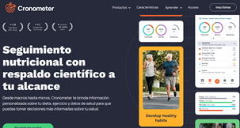
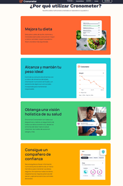
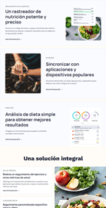
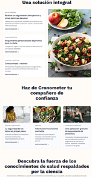
#### FatSecret
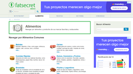
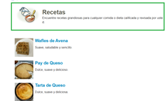
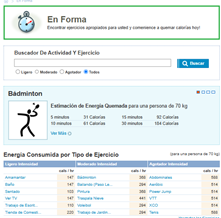
#### MyFitnessPal
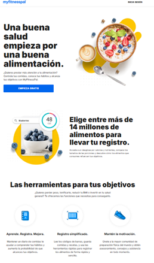
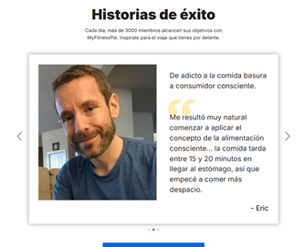
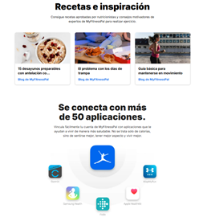
### Diseño y Resultados de Encuesta
Para poder crear nuestra aplicación realizamos una encuesta de 12 preguntas que utilizaremos para saber qué es lo puede llevar nuestra aplicación con la opinión de las personas nos podemos guiar para saber qué es lo que ellos buscan de una aplicación. Las preguntas que se realizaron fueron preguntas abiertas y otras para seleccionar.

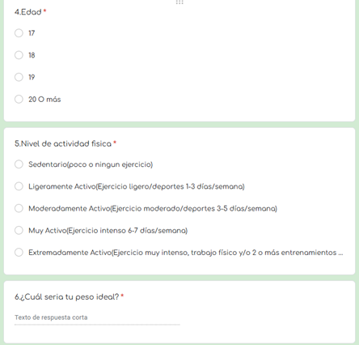
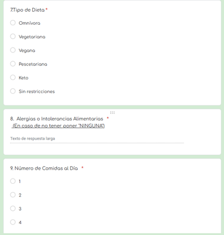
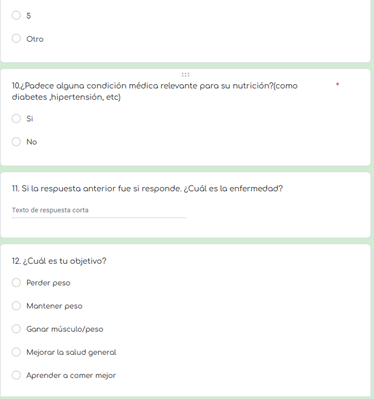
### Resultados de las preguntas
En total fueron 32 personas a los que respondieron esta encuesta y fueron encuestados. Aquí se muestran las gráficas de los resultados de la encuesta.
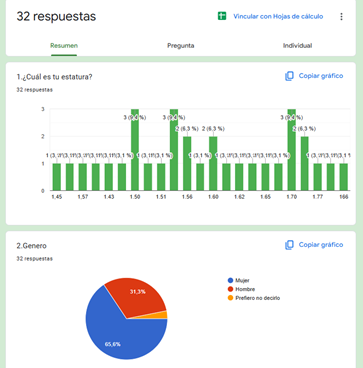
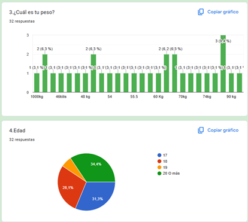
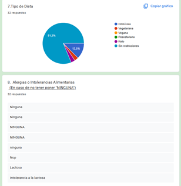
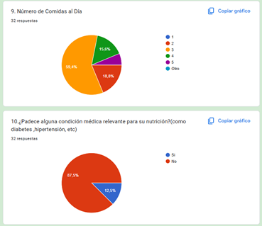
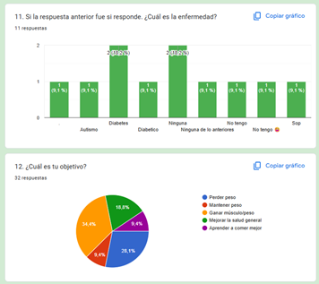
Podemos ver en lo que se muestra que las personas que han sido entrevistadas miden entre 1.45 a 1.77 y que un 65,6% es mujer, también que el peso de las personas entrevistadas rondan entre 46 a 90 kg y la edad mínima es de 17 y la máxima de 20 o más esto nos puede ayudar a calcular cual es el tipo de comida que podemos recomendar basándonos en esos datos también en el dato de la pregunta sobre si es alérgico a algún alimento o intolerante a alguno, solo hubo dos personas que respondieron que son intolerantes a la lactosa, así que podemos poner un espacio en donde haya alimento sin lactosa como leche, queso y otros. También a las personas que respondieron que son diabéticas, podemos poner un espacio en donde haya alimentos sin azucares y alimentos que ayuden a mantener la glucosa en su lugar. 
Vemos que el objetivo de la mayoría de las personas es bajar de peso o mantenerlo, así que la aplicación sería más para ayudarlos a bajar de peso y para que ellos lo puedan mantener, bueno también pensando en el peso que ellos deberían tener con la altura y la edad, porque podemos querer bajar de peso, pero si al ver nuestra altura y edad dice que tenemos un buen peso, solo tendríamos que mantenerlo y no bajar para no tener consecuencias en un futuro.
Así que nuestra aplicación se va a basar en recetas para todas las personas y especiales para diabéticos, intolerantes a la lactosa y tal vez ejercicios que ayuden a mantener el cuerpo, y a bajar de peso.
### Síntesis de aprendizajes
Al analizar Cronometer, FatSecret y MyFitnessPal, me di cuenta de que una buena app de nutrición necesita ser fácil de usar y al mismo tiempo ofrecer información confiable sobre los alimentos. También noté que muchas funciones útiles suelen estar bloqueadas en las versiones de pago, lo que puede frustrar al usuario si la mayoría de las cosas básicas son de pago.
### Oportunidades identificadas para desarrollo futuro
Ofrecer funciones completas sin depender tanto de la versión de pago, tener un diseño más sencillo y visual, incluir recomendaciones personalizadas según hábitos y objetivos, integrar seguimiento de actividad y hábitos, y agregar elementos de motivación como logros o comunidad.
### Recomendaciones para la futura aplicación
Todo esto me sirve para pensar en lo que quiero en nuestra app: Necesitamos que esta app sea clara y útil, que de verdad tenga funciones que nos resulten atractivas y fáciles de llevar y lo más importante es que en nuestra app las cosas básicas e importantes no sean de pago.
###	Encuesta realizada
[Encuesta](https://docs.google.com/forms/d/e/1FAIpQLSeyIgx1lfXuCotFFES4miZMGapLY_rqyE7HDT-gv9H24H0uBA/viewform?usp=header)